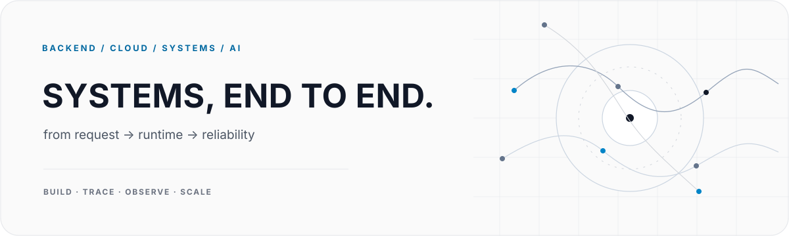
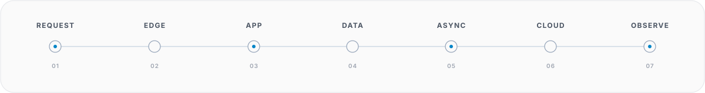

<picture>
  <source media="(prefers-color-scheme: dark)" srcset="./hero-dark.svg">
  <source media="(prefers-color-scheme: light)" srcset="./hero-light.svg">
  
</picture>

<p align="center">
  <code>backend engineering</code>&nbsp;&nbsp;
  <code>cloud infrastructure</code>&nbsp;&nbsp;
  <code>distributed systems</code>&nbsp;&nbsp;
  <code>AI engineering</code>
</p>

<br>

I’m a **Software Engineer** with a background in **Computer Systems Engineering**, focused on backend platforms, cloud infrastructure, distributed systems, and applied AI. My work spans API design, data and asynchronous processing, infrastructure, deployment, and production reliability.

I’m particularly interested in how systems behave beyond implementation: component boundaries, failure modes, observability, scalability, and the architectural trade-offs required to operate software reliably in production.

<br>

<picture>
  <source media="(prefers-color-scheme: dark)" srcset="./system-path-dark.svg">
  <source media="(prefers-color-scheme: light)" srcset="./system-path-light.svg">
  
</picture>

<br>

## `01 / areas of focus`

**Backend Engineering**  
API and domain design, authentication and authorization, multi-tenant architecture, payments, webhooks, integrations, real-time communication, and asynchronous workloads.

**Cloud & Platform Engineering**  
Networking, DNS/TLS, containerized workloads, reverse proxies, cloud infrastructure, CI/CD, observability, deployment architecture, and production reliability.

**AI Engineering**  
Model APIs, retrieval and RAG, agentic workflows, tool integration, orchestration, and AI capabilities embedded into production applications.

**Product Engineering**  
Responsive interfaces, component architecture, design systems, and end-to-end product delivery across frontend and backend boundaries.

<br>

## `02 / technical stack`

<p align="center"><sub><b>LANGUAGES & RUNTIMES</b></sub></p>
<p align="center">
  &nbsp;&nbsp;&nbsp;
  &nbsp;&nbsp;&nbsp;
  &nbsp;&nbsp;&nbsp;
  &nbsp;&nbsp;&nbsp;
  
</p>

<br>

<p align="center"><sub><b>BACKEND</b></sub></p>
<p align="center">
  &nbsp;&nbsp;&nbsp;
  &nbsp;&nbsp;&nbsp;
  &nbsp;&nbsp;&nbsp;
  &nbsp;&nbsp;&nbsp;
  
</p>

<br>

<p align="center"><sub><b>DATA & ASYNCHRONOUS PROCESSING</b></sub></p>
<p align="center">
  &nbsp;&nbsp;&nbsp;
  &nbsp;&nbsp;&nbsp;
  &nbsp;&nbsp;&nbsp;
  
</p>

<br>

<p align="center"><sub><b>CLOUD & INFRASTRUCTURE</b></sub></p>
<p align="center">
  &nbsp;&nbsp;&nbsp;
  &nbsp;&nbsp;&nbsp;
  &nbsp;&nbsp;&nbsp;
  &nbsp;&nbsp;&nbsp;
  
</p>

<br>

<p align="center"><sub><b>FRONTEND & PRODUCT</b></sub></p>
<p align="center">
  &nbsp;&nbsp;&nbsp;
  &nbsp;&nbsp;&nbsp;
  &nbsp;&nbsp;&nbsp;
  &nbsp;&nbsp;&nbsp;
  &nbsp;&nbsp;&nbsp;
  
</p>

<br>

<p align="center"><sub><b>AI, LLMs & AGENTS</b></sub></p>
<p align="center">
  &nbsp;&nbsp;&nbsp;
  &nbsp;&nbsp;&nbsp;
  &nbsp;&nbsp;&nbsp;
  
</p>

<br>

<p align="center"><sub><b>AI CODING TOOLS</b></sub></p>
<p align="center">
  &nbsp;&nbsp;&nbsp;
  &nbsp;&nbsp;&nbsp;
  &nbsp;&nbsp;&nbsp;
  &nbsp;&nbsp;&nbsp;
  
</p>

<br>

<p align="center"><sub><b>ML & ROBOTICS</b></sub></p>
<p align="center">
  &nbsp;&nbsp;&nbsp;
  
</p>

<br>

<p align="center"><sub><b>TOOLING & WORKFLOW</b></sub></p>
<p align="center">
  &nbsp;&nbsp;&nbsp;
  &nbsp;&nbsp;&nbsp;
  &nbsp;&nbsp;&nbsp;
  &nbsp;&nbsp;&nbsp;
  &nbsp;&nbsp;&nbsp;
  
</p>

<br>

## `03 / current development focus`

**Systems engineering**

```text
networking & operating systems
        ↓
containers & cloud infrastructure
        ↓
distributed systems & asynchronous processing
        ↓
observability & reliability
        ↓
system architecture
```

**AI engineering**

```text
model APIs → retrieval → RAG → agentic systems → production AI
```

<br>

## `04 / engineering approach`

**System understanding**  
Understand the underlying model, constraints, and trade-offs rather than relying only on framework-level abstractions.

**Operability**  
Design with observability, diagnosability, failure recovery, and maintainability in mind.

**Pragmatic architecture**  
Choose patterns based on requirements and operational cost, and avoid unnecessary complexity before it is justified.

**End-to-end ownership**  
Connect product requirements with backend design, infrastructure, delivery, and production behavior.

<br>

---

<p align="center">
  <sub><b>backend engineering · cloud infrastructure · distributed systems · AI engineering</b></sub>
</p>
